# Kingdom of Logic

A discrete-mathematics adventure game for ages 10 to 15, packaged as an Android app.

Players flip switches, pull levers and open doors to fix the kingdom's broken magic. Each of the nine areas teaches one idea from logic (AND, OR, NOT, XOR, compound rules, truth tables, deduction and IF-THEN), and the final castle combines them all. The game works fully offline and saves progress on the phone.

GitHub builds the Android app (`.apk`) for free on every push. See [Build the Android app](#build-the-android-app) below.

<p align="center">
  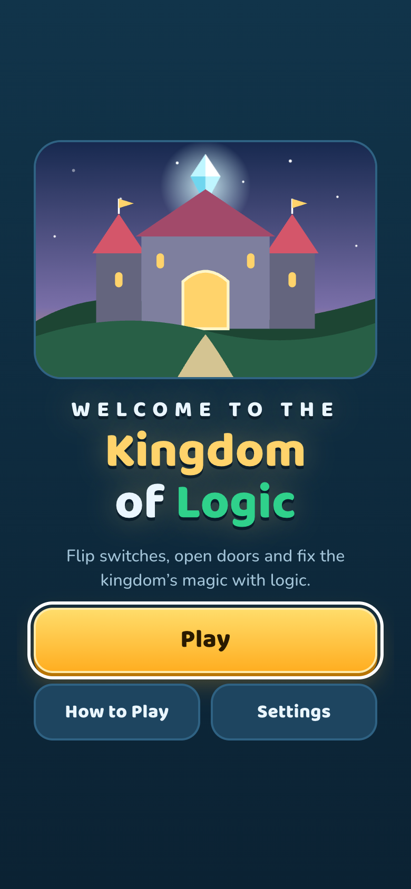
  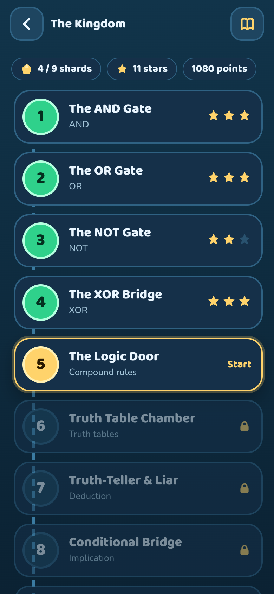
  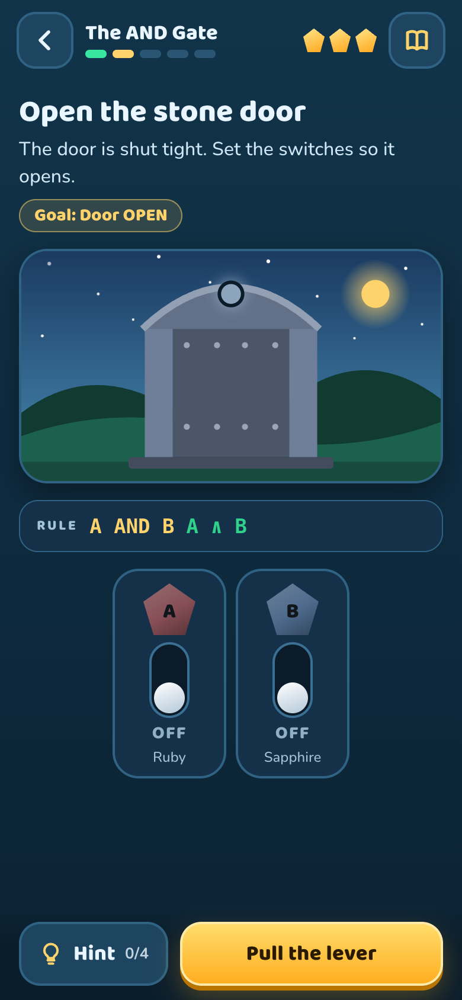
</p>

## Screenshots

All screenshots are taken at phone size (390 × 844).

| Home | How to Play | Settings |
| :---: | :---: | :---: |
|  | 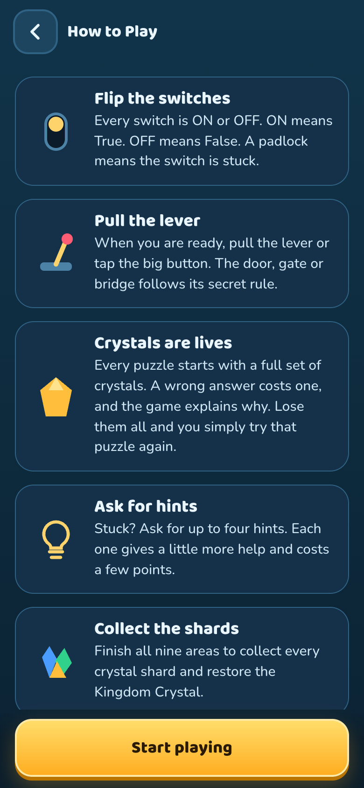 | 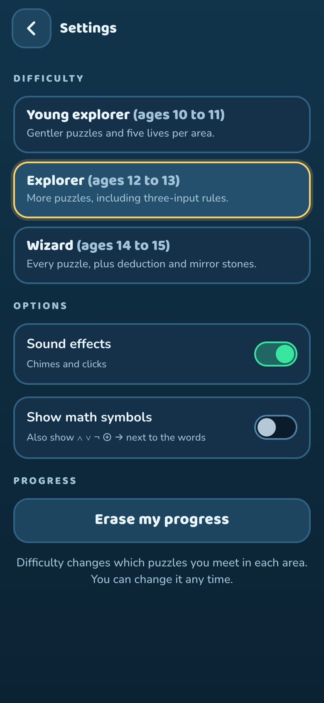 |
| Title screen with Play, How to Play and Settings. | Five cards that explain the rules of the game. | Difficulty, sound, math symbols and progress reset. |

| Kingdom map | Area intro | Switch puzzle |
| :---: | :---: | :---: |
|  | 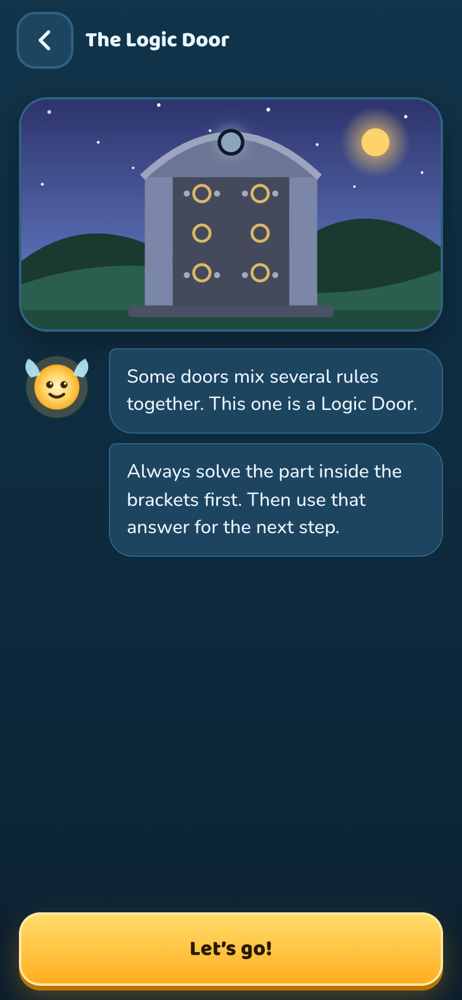 |  |
| The nine areas, with shards, stars and points. Areas unlock in order. | Luma the guide explains each new idea before the puzzles start. | Set the switches so the rule opens the door, then pull the lever. |

| Rulebook | Truth table | Truth-Teller & Liar |
| :---: | :---: | :---: |
| 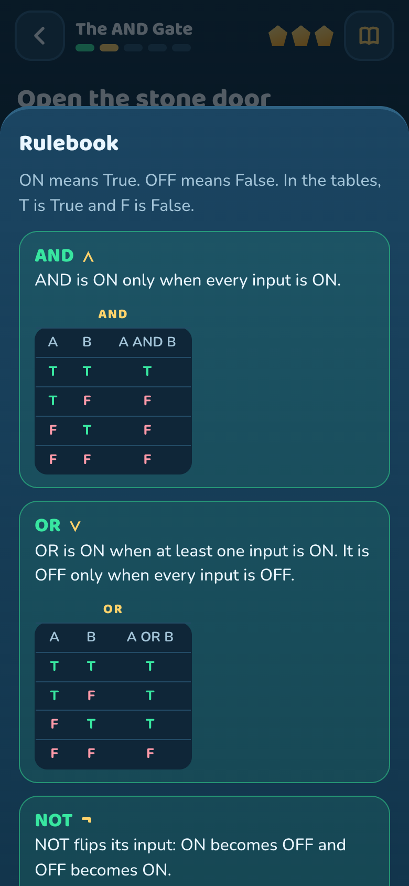 | 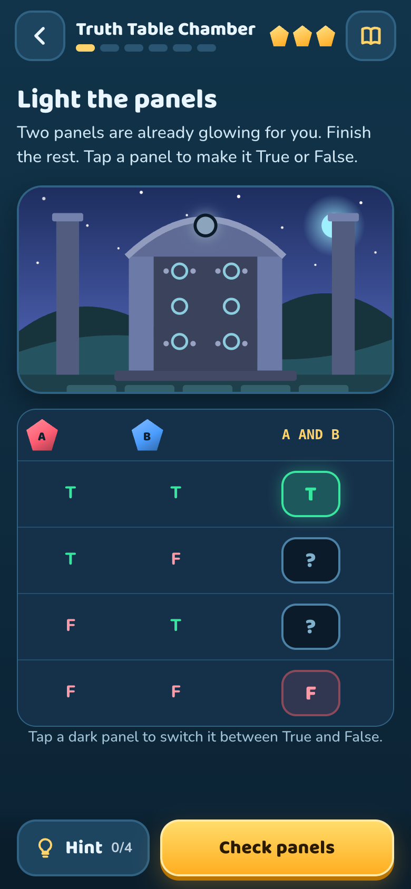 | 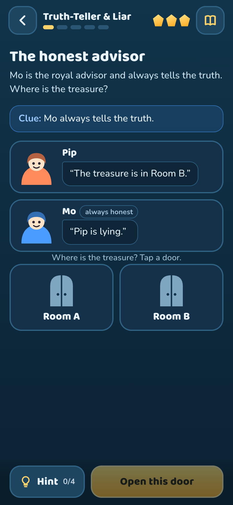 |
| Every rule learned so far, with its truth table. Open it at any time. | Fill in the True / False panels for a rule. | Use the clues to work out who is lying and where the treasure is. |

| Shard collected | Crystal restored |
| :---: | :---: |
| 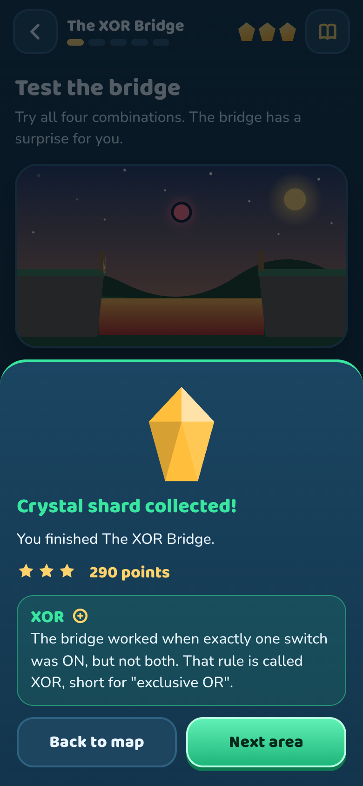 | 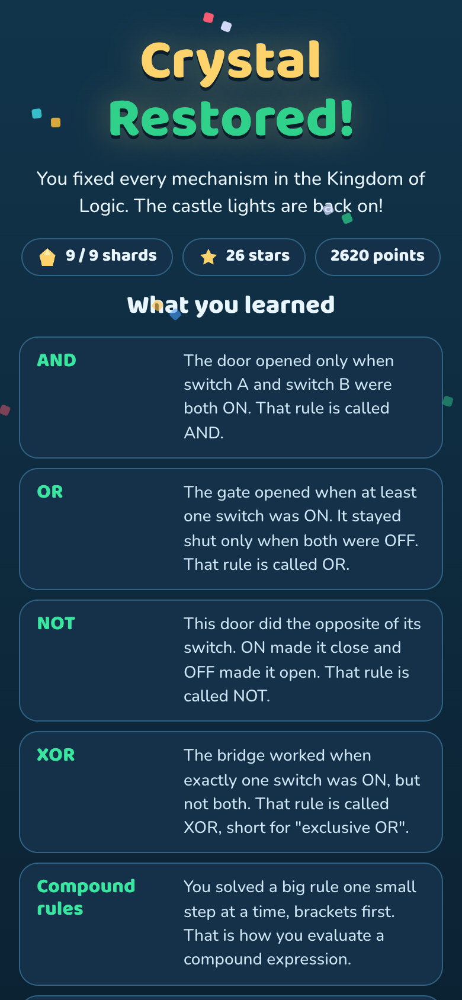 |
| Finishing an area gives a crystal shard, stars and a one-line summary of what was learned. | The ending screen after all nine areas, with a recap of every concept. |

## How the game works

- **Switches:** every switch is ON (True) or OFF (False). A padlock means the switch is stuck.
- **Lever:** when the player is ready, they pull the lever and the door, gate or bridge follows its rule.
- **Crystals are lives:** each puzzle starts with a full set. A wrong answer costs one and the game explains why. Losing them all simply restarts that puzzle.
- **Hints:** up to four per puzzle, each giving more help and costing a few points.
- **Stars and points:** fewer hints and fewer mistakes give more points and up to three stars per area.
- **Rulebook:** shows every rule met so far with its truth table.

## The nine areas

| # | Area | Concept | Symbol |
| :-: | --- | --- | :-: |
| 1 | The AND Gate | AND | ∧ |
| 2 | The OR Gate | OR | ∨ |
| 3 | The NOT Gate | NOT | ¬ |
| 4 | The XOR Bridge | XOR (exclusive OR) | ⊕ |
| 5 | The Logic Door | Compound rules, brackets first | ( ) |
| 6 | Truth Table Chamber | Truth tables | T / F |
| 7 | Truth-Teller & Liar | Logical deduction | ⇒ |
| 8 | Conditional Bridge | Implication (IF-THEN) | → |
| 9 | The Logic Castle | Everything combined | ★ |

## Difficulty levels

Difficulty can be changed at any time in **Settings**. It changes which puzzles appear in each area.

| Level | Ages | What changes |
| --- | --- | --- |
| Young explorer | 10 to 11 | Gentler puzzles and five lives |
| Explorer (default) | 12 to 13 | More puzzles, including three-input rules; three lives |
| Wizard | 14 to 15 | Every puzzle, plus deduction and mirror stones; three lives |

**Show math symbols** in Settings adds the formal symbols (∧ ∨ ¬ ⊕ →) next to the words.

## Technical overview

- **The game:** one self-contained file, `index.html` (HTML, CSS and plain JavaScript, no frameworks). It runs in any modern browser, so you can open it directly to try the game on a computer.
- **Android wrapper:** [Capacitor](https://capacitorjs.com/) turns `index.html` into a native Android app (`com.kingdomoflogic.game`).
- **Saving:** progress and settings are stored on the device (`localStorage`). No account, no internet and no data collection.
- **Back button:** on Android, Back steps out of the current screen like the arrow at the top-left. On the home screen, pressing Back twice leaves the app.
- **Build:** a GitHub Actions workflow builds the APK and publishes it as a Release called `latest`.

### Project files

| File | Purpose |
| --- | --- |
| `index.html` | The whole game |
| `capacitor.config.json` | App name, ID and dark theme for Android |
| `package.json`, `package-lock.json` | Capacitor tools used by the build |
| `prepare_android.sh` | Creates the Android project from the files here |
| `patch_android.py` | Makes the Android app portrait-only with a dark theme |
| `icon-*.png`, `splash*.png` | App icon and splash screen |
| `.github/workflows/build-apk.yml` | The GitHub build that produces the APK |
| `screenshots/` | Screenshots used in this README (not needed for the build) |

## Build the Android app

The game files sit at the top level on purpose, so they can be uploaded with a normal file picker. The only folder is `screenshots/`, which is for this README and is not needed by the build.

### 1. Upload the files
1. Open your repository, click **Add file**, then **Upload files**.
2. Open this unzipped folder, select **all the files** (Ctrl+A or Cmd+A) and drag them into the page. Wait until all of them are listed. To show the screenshots in the README, also drag in the `screenshots` folder.
3. Click **Commit changes**.

### 2. Start the build (this moves one file)
1. In the repository, click **build-apk.yml** to open it, then click the **pencil** icon (Edit).
2. Click the file name box at the top. Click at the very start of the name, and type `.github/workflows/` so it reads `.github/workflows/build-apk.yml`.
3. Click **Commit changes**, then **Commit changes** again.

The build starts by itself. Do this step last, after all the other files are uploaded.

### 3. Wait for the green tick
Open the **Actions** tab. A run called **Build Android APK** takes about 5 to 10 minutes. If it never starts, click **Build Android APK** on the left, then **Run workflow**.

### 4. Install on the phone
1. On the phone, open `github.com/YOUR-NAME/kingdom-of-logic/releases/tag/latest`.
2. Tap **KingdomOfLogic.apk** to download it.
3. Open the downloaded file. Allow "install from this source" if asked, then tap **Install**.
4. If Play Protect warns you, tap **More details**, then **Install anyway**. The warning appears because the app is not from the Play Store.

The APK is also in the Actions run under *Artifacts* (inside a .zip).

### If the build shows a red cross
Open the run, open the red step, and copy the last 30 lines of its log. A message that starts with `ERROR:` names a file that did not upload: add it at the top level of the repository and press **Run workflow**.

## Build on your own computer (optional)

Needs Node.js 22, Java 21 and the Android SDK.

```bash
npm ci
npm run android:prepare   # creates ./android
npm run android:apk       # APK in android/app/build/outputs/apk/debug/
```
